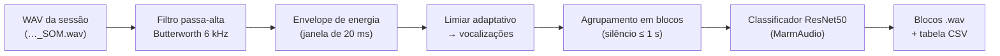

# marmovoc

**Segmentação e classificação automáticas de vocalizações de saguis (*Callithrix jacchus*) em gravações contínuas de experimentos comportamentais.**


O `marmovoc` recebe o áudio completo de uma sessão experimental (um arquivo WAV de vários minutos), localiza os trechos com vocalização, recorta cada trecho em um arquivo próprio e atribui a ele um tipo de chamada — Phee, Twitter, Trill, Tsik, Seep ou Infant cry — usando o classificador público do conjunto de dados **MarmAudio** (Lamothe et al., 2025).

O pacote integra o pipeline de aquisição do **Marmosync**, que sincroniza vídeo, eletrofisiologia (Open Ephys) e áudio em experimentos com saguis: ao fim de cada sessão, o Marmosync chama o `marmovoc` sobre o WAV gravado. Também pode ser usado de forma independente, por linha de comando, interface gráfica ou como biblioteca Python.

---

## Sumário

- [Visão geral do pipeline](#visão-geral-do-pipeline)
- [Instalação](#instalação)
- [Uso](#uso)
- [Saídas](#saídas)
- [Método](#método)
- [Parâmetros](#parâmetros)
- [Validação](#validação)
- [Limitações conhecidas](#limitações-conhecidas)
- [Estrutura do projeto](#estrutura-do-projeto)
- [Desenvolvimento](#desenvolvimento)
- [Como citar](#como-citar)
- [Créditos e licenças](#créditos-e-licenças)

---

## Visão geral do pipeline



| Etapa | Módulo | Descrição resumida |
|---|---|---|
| Segmentação | `marmovoc.segmentacao` | Filtragem, detecção por energia e agrupamento de vocalizações próximas em blocos |
| Classificação | `marmovoc.classificacao` | Inferência do tipo de chamada por vocalização; o bloco recebe o rótulo de maior confiança |
| Orquestração | `marmovoc.pipeline` | Leitura do WAV, gravação dos blocos e montagem da tabela de resultados |
| Modelo | `marmovoc.modelos` | Download, verificação e cache local do classificador |

---

## Instalação

**Requisitos:** Python 3.9 ou superior. Para classificar, PyTorch e torchvision (instalados pelo extra `classificacao`, ~2 GB).

```bash
pip install "marmovoc[classificacao] @ git+https://github.com/DvdMeneses/marmovoc.git"
```

| Extra | Inclui | Quando usar |
|---|---|---|
| *(nenhum)* | numpy, scipy, soundfile, pandas, ttkbootstrap | Apenas segmentação (`--sem-classificar`) |
| `classificacao` | torch, torchvision | Segmentação e classificação |
| `denoise` | noisereduce | Função de redução de ruído do MarmAudio (`_vendor.marmaudio.denoise`) |
| `dev` | pytest | Desenvolvimento e testes |

### Modelo de classificação

O classificador (~94 MB) **não é distribuído neste repositório**. Ele é obtido da fonte oficial — o registro do MarmAudio no Zenodo — na primeira classificação, e mantido em cache local (`%LOCALAPPDATA%\marmovoc` no Windows, `~/.cache/marmovoc` nos demais sistemas). Para fazer o download antecipadamente:

```bash
marmovoc baixar-modelos
```

Ambientes sem acesso à internet podem apontar para uma cópia local do modelo com `--modelos <pasta>` ou com a variável de ambiente `MARMOVOC_MODELOS`. O diretório de cache pode ser alterado com `MARMOVOC_CACHE`.

---

## Uso

### Interface gráfica

```bash
marmovoc-gui
```

Permite selecionar arquivos ou uma pasta inteira de gravações, escolher a pasta de saída e acompanhar o processamento arquivo a arquivo. A tabela de entrada exibe a duração e a taxa de amostragem de cada gravação, sinalizando taxas inferiores à do treinamento do modelo (96 kHz).

### Linha de comando

```bash
# Segmentar e classificar um arquivo, vários, ou todos os .wav de uma pasta
marmovoc segmentar sessao_SOM.wav --saida resultados

# Apenas segmentar (sem PyTorch)
marmovoc segmentar gravacoes/ --saida resultados --sem-classificar

# Duração total dos blocos extraídos, por gravação (gera durations.txt)
marmovoc duracao resultados
```

| Opção de `segmentar` | Padrão | Descrição |
|---|---|---|
| `--saida` | — (obrigatória) | Pasta de saída |
| `--modelos` | cache / Zenodo | Pasta com o `.stdc` e o `.tsv` do classificador |
| `--sem-classificar` | desligada | Executa só a segmentação |
| `--csv` | `<saida>/vocalization_analysis_corrected.csv` | Caminho da tabela de resultados |
| `--cutoff` | 6000 | Frequência de corte do passa-alta (Hz) |
| `--merge` | 1.0 | Silêncio máximo (s) entre vocalizações de um mesmo bloco |
| `-v` | — | Log detalhado |

### Biblioteca Python

```python
from marmovoc import Classificador, ParametrosSegmentacao, processar_arquivos, segmentar

# Pipeline completo
clf = Classificador.da_pasta()          # usa o cache; baixa do Zenodo na 1ª vez
tabela = processar_arquivos(["sessao_SOM.wav"], "resultados", clf)

# Apenas a segmentação, sobre um sinal já carregado
audio_filtrado, blocos = segmentar(audio, sample_rate, ParametrosSegmentacao(merge_threshold=0.5))
```

### Integração com o Marmosync

Com `MARMOSYNC_VOC_MODELOS=auto` no `.env` do Marmosync, a análise é executada automaticamente ao fim de cada experimento, como última etapa — depois que todos os dados brutos já foram salvos. Os resultados ficam em `vocalizacoes/`, dentro da pasta do experimento.

---

## Saídas

```
resultados/
├── <gravação>/
│   ├── <gravação>_block_001_0m9s-0m11s.wav
│   ├── <gravação>_block_002_0m19s-0m24s.wav
│   └── …
└── vocalization_analysis_corrected.csv
```

Cada bloco é salvo já filtrado (passa-alta), na taxa de amostragem original. O nome do arquivo codifica o índice do bloco e o intervalo (resolução de 1 s), formato consumido por ferramentas de análise posteriores.

**Tabela de resultados** (`vocalization_analysis_corrected.csv`, UTF-8 com BOM, separador vírgula):

| Coluna | Tipo | Descrição |
|---|---|---|
| `original_file` | texto | Gravação de origem |
| `block_file` | texto | Arquivo do bloco recortado |
| `block_index` | inteiro | Índice do bloco na gravação (1, 2, …) |
| `start_time_seconds` | real | Início do bloco, em segundos desde o início do WAV |
| `end_time_seconds` | real | Fim do bloco, em segundos desde o início do WAV |
| `duration_seconds` | real | Duração do bloco |
| `offset_in_block_seconds` | real | Reservado (sempre 0,0 — mantido por compatibilidade) |
| `predicted_label` | texto | Tipo de chamada previsto (`Phee`, `Twitter`, `Trill`, `Tsik`, `Seep`, `Infant`) |
| `confidence_percent` | real | Confiança da previsão (softmax, %) |
| `energy_max` | real | Energia normalizada máxima da vocalização que definiu o rótulo |
| `start_time_formatted` / `end_time_formatted` | texto | Início e fim em `XmYs` |

> **Alinhamento temporal.** Os tempos são relativos ao início do arquivo WAV. Nas gravações do Marmosync, o WAV começa alguns segundos depois do vídeo; o deslocamento exato está em `inicio_wav_relativo_experimento_s`, no arquivo `<prefixo>_SOM_INFO.csv` da sessão.

---

## Método

### 1. Pré-processamento

O sinal (canal 1, se estéreo) passa por um filtro **Butterworth passa-alta de 5ª ordem, 6 kHz**, aplicado com fase zero (`scipy.signal.filtfilt`). O corte remove ruído de baixa frequência do ambiente (equipamentos, ventilação, movimentação) preservando a faixa das chamadas de saguis.

### 2. Detecção de vocalizações

1. Envelope de energia: |x(t)| suavizado por média móvel de 20 ms e normalizado pelo máximo da gravação.
2. Limiar: o maior valor entre um limiar fixo (0,02) e um limiar adaptativo igual a 80% do percentil 95 do envelope.
3. Cada região contínua acima do limiar com duração entre **50 ms e 5 s** é aceita como vocalização e recebe uma margem de 50 ms antes e depois.

### 3. Agrupamento em blocos

Vocalizações separadas por até **1 s** de silêncio são agrupadas em um mesmo bloco, que corresponde a uma emissão (por exemplo, as sílabas de um Phee). Blocos com menos de **0,3 s** são descartados.

### 4. Classificação

Cada vocalização do bloco é classificada pela **ResNet50** treinada no conjunto MarmAudio. O frontend converte o sinal em espectrograma log-Mel: STFT com janela de 1024 e salto de 368 amostras, 128 bandas Mel entre 1 e 48 kHz, para áudio a 96 kHz. Vocalizações com pico de amplitude abaixo de 0,01 são ignoradas. O bloco recebe o rótulo da vocalização com **maior confiança**, e é mantido na tabela se essa confiança for de pelo menos **10%**.

As seis classes e o número de exemplos de cada uma no treinamento do modelo:

| Classe | Exemplos |
|---|---|
| Twitter | 65 656 |
| Tsik | 46 855 |
| Phee | 38 103 |
| Trill | 31 086 |
| Infant (Infant cry) | 29 684 |
| Seep | 4 697 |

---

## Parâmetros

Todos os valores estão em `marmovoc.segmentacao.ParametrosSegmentacao` e reproduzem o script de análise original do laboratório.

| Parâmetro | Padrão | Efeito |
|---|---|---|
| `cutoff_hz` | 6000 | Corte do filtro passa-alta (Hz) |
| `ordem_filtro` | 5 | Ordem do Butterworth |
| `threshold` | 0,02 | Limiar mínimo do envelope normalizado |
| `min_duration` | 0,05 s | Duração mínima de uma vocalização |
| `max_duration` | 5,0 s | Duração máxima de uma vocalização (permite Phees longos) |
| `silence_duration` | 0,05 s | Margem adicionada antes e depois de cada vocalização |
| `merge_threshold` | 1,0 s | Silêncio máximo dentro de um bloco |
| `duracao_minima_bloco` | 0,3 s | Blocos mais curtos são descartados |

Corte de confiança da tabela: `marmovoc.pipeline.CONFIANCA_MINIMA_PERCENT` (10%).

---

## Validação

**Equivalência com o script original.** O `marmovoc` é a reorganização em biblioteca de scripts de análise já em uso no laboratório. Em uma gravação real de sessão de habituação (718,6 s, 44,1 kHz), as duas implementações produziram:

| Critério | Resultado |
|---|---|
| Sinal filtrado | idêntico (amostra a amostra) |
| Blocos detectados | 24 × 24, com tempos de início e fim idênticos |
| Rótulo e confiança por bloco | 0 divergências |
| Nomes dos arquivos gerados | 24 de 24 coincidentes com a extração anterior |

**Testes automatizados.** A suíte (`tests/`) cobre a segmentação com sinais sintéticos (detecção, agrupamento, filtragem e descarte de blocos curtos), a regra de votação da classificação, o cálculo de duração e o download/cache do modelo — sem depender do modelo real, de GPU ou de acesso à internet.

**Desempenho do classificador.** A acurácia do classificador é a reportada pelos autores do MarmAudio (taxa de erro média de 9,43% na validação por especialistas, com áudio a 96 kHz). Ela não foi reavaliada nas condições de gravação deste laboratório — ver limitações.

---

## Limitações conhecidas

- **Taxa de amostragem.** O classificador foi treinado com áudio a 96 kHz e o sinal não é reamostrado antes da inferência. Gravações a 44,1 ou 48 kHz alteram a escala de frequência vista pelo modelo e não contêm energia acima de 22–24 kHz. Nos dados do laboratório, chamadas do tipo Phee foram classificadas com confiança entre 97% e 100%; as demais classes ainda não foram avaliadas nessas condições.
- **Corte de confiança único.** A tabela aplica um corte de 10% para todas as classes. Os autores do MarmAudio usam cortes por classe (Infant cry ≥ 0,5; Phee, Tsik e Twitter ≥ 0,7; Seep e Trill ≥ 0,86) e rotulam como "Vocalization" o que fica abaixo deles.
- **Detecção por energia.** A segmentação não distingue vocalizações de outros ruídos agudos de mesma energia (por exemplo, impactos na caixa experimental); esses eventos podem gerar blocos com rótulos de baixa confiança.
- **Resolução dos nomes de arquivo.** O intervalo no nome do bloco tem resolução de 1 s; os tempos exatos estão na tabela CSV.
- **Caminhos no Windows.** Sem suporte a caminhos longos habilitado no sistema, caminhos de saída acima de 259 caracteres não podem ser gravados; a interface gráfica verifica isso antes de iniciar.

---

## Estrutura do projeto

```
marmovoc/
├── pyproject.toml
├── src/marmovoc/
│   ├── segmentacao.py      # filtro, detecção e agrupamento
│   ├── classificacao.py    # Classificador e votação por bloco
│   ├── pipeline.py         # processamento de arquivos e tabela de resultados
│   ├── modelos.py          # download e cache do classificador (Zenodo)
│   ├── duracao.py          # duração total dos blocos por gravação
│   ├── cli.py              # comando `marmovoc`
│   ├── gui.py              # interface `marmovoc-gui`
│   └── _vendor/marmaudio/  # código do MarmAudio (BSD-3-Clause)
└── tests/
```

---

## Desenvolvimento

```bash
git clone https://github.com/DvdMeneses/marmovoc.git
cd marmovoc
pip install -e ".[classificacao,dev]"
python -m pytest
```

A instalação em modo editável (`-e`) faz alterações no código-fonte valerem sem reinstalar o pacote.

---

## Como citar

Se este software for utilizado em trabalhos acadêmicos, cite o repositório e, obrigatoriamente, o trabalho que originou o classificador:

```bibtex
@software{meneses_marmovoc,
  author  = {Meneses, David},
  title   = {marmovoc: segmentação e classificação de vocalizações de saguis},
  version = {0.3.0},
  url     = {https://github.com/DvdMeneses/marmovoc}
}

@article{lamothe2025marmaudio,
  author  = {Lamothe, Charly and Obliger-Debouche, Manon and Best, Paul and Trapeau, R{\'e}gis
             and Ravel, Sabrina and Arti{\`e}res, Thierry and Marxer, Ricard and Belin, Pascal},
  title   = {A large annotated dataset of vocalizations by common marmosets},
  journal = {Scientific Data},
  volume  = {12},
  pages   = {782},
  year    = {2025},
  doi     = {10.1038/s41597-025-04951-8}
}
```

---

## Créditos e licenças

- **Classificador e código de inferência:** projeto MarmAudio — Lamothe, C., Obliger-Debouche, M., Best, P. *et al.* *A large annotated dataset of vocalizations by common marmosets.* Scientific Data 12, 782 (2025). <https://doi.org/10.1038/s41597-025-04951-8>
  - Código em `src/marmovoc/_vendor/marmaudio`: BSD-3-Clause (ver `LICENCE.txt` na pasta). A única alteração é a conversão dos imports para imports relativos.
  - Modelo treinado: obtido de <https://doi.org/10.5281/zenodo.15017207> (`Code_Usage.zip`), sob licença CC BY 4.0. Não é redistribuído por este repositório.
- **Licença deste projeto:** a definir.
